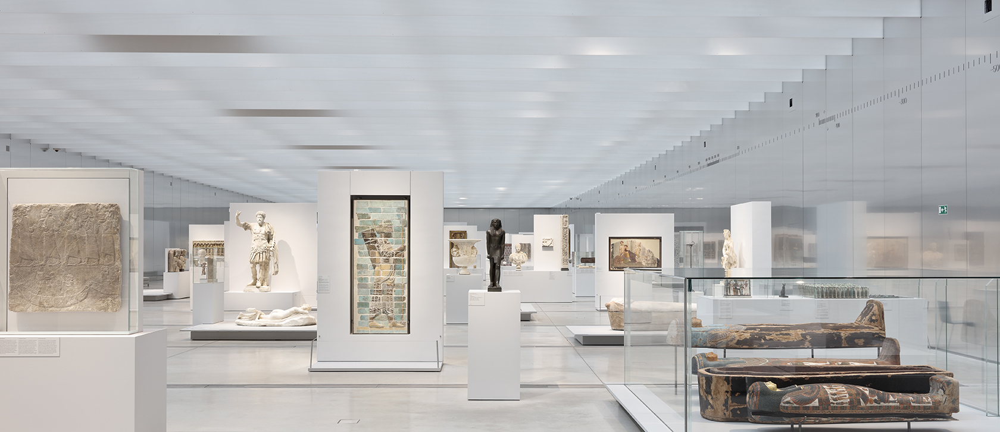
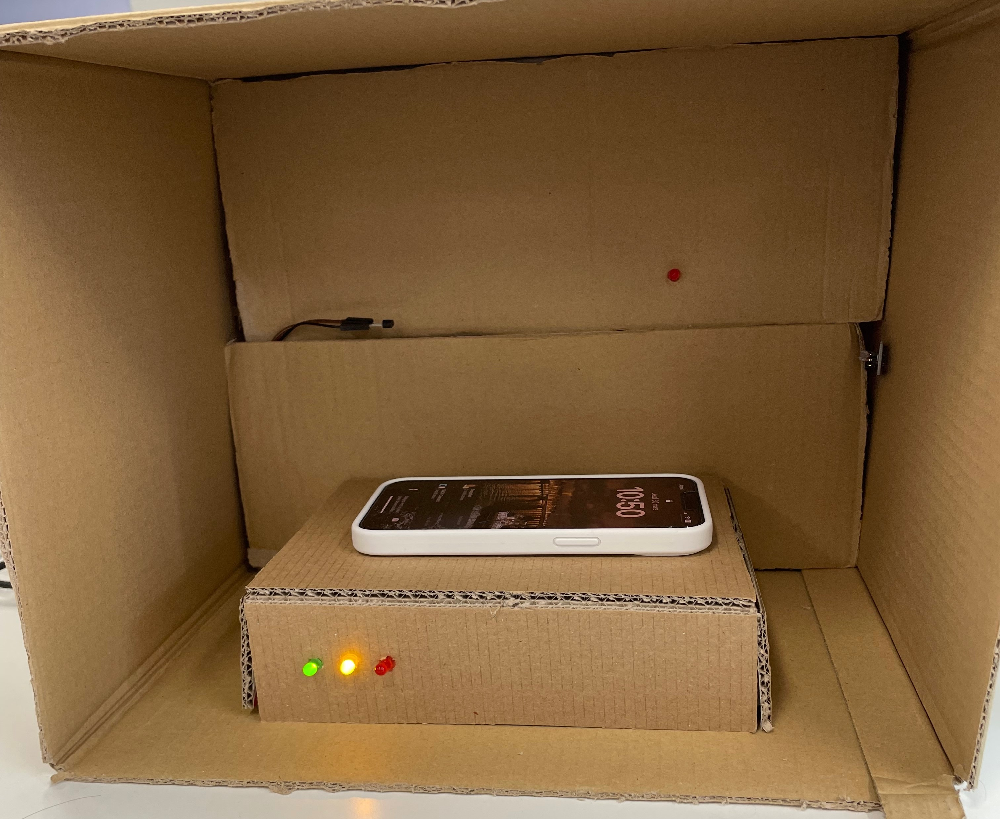

# ArtKeeper

Ce projet avait pour but de concevoir une solution complète architecturée autour d'un microcontrolleur STM32. Nous avons donc pensé à un système de sécurité et de conservation des oeuvres d'art. Ce système permet de maintenir des conditions de conservation optimales et d'empêcher tout vol.

## Une protection optimale

Offrez à vos précieuses œuvres d'art une protection de super-héros avec notre système électronique qui détecte même les tentatives les plus sournoises de vol et maintient leur environnement en mode de confort optimal.

## Objectifs

* Contrôler les paramètres de l’environnement ambiant (température, luminosité).
* Consulter les données en temps réel : s'ils diffèrent des paramètres souhaité, l’alerte est donnée, pour rétablir la situation au plus vite
* Prévenir du vol : si l’objet est déplacé, l’alerte est
donnée.

## Capteurs

* Luminosité : Contrôle du taux de luminosité afin de conserver les œuvres dans des conditions optimales

* Température : Contrôle de la variation de température dans la pièce où l'œuvre est stockée

* Pression : Capteur de pression antivol qui détecte si l'objet de valeur est retiré de son socle

## Pour qui ?

* Musée et galerie d'art
* Vente aux enchères
* Particuliers
* Collectionneurs

## Composition

- Photorésistance
- Capteur de pression
- Capteur de température
- LEDs
- Buzzer actif

## Fonctionnement

### Calibrage et messure

Les capteurs se calibrent et mesurent les données de l'environnement (température, luminosité, pression) lorsque le système est armé.  

3 indicateurs (LEDs) :

* Orange : système fonctionnel
* Verte : système armé
* Rouge : système compromis ou désarmé

### Détection des variations

Les capteurs envoient des données en temps réel et le système détecte automatiquement les variations de température, de luminosité et de pression.

### Alerte

Si les paramètres ambiant ne respectent plus le seuil fixé, l'alarme se déclenche. Un mot de passe est requis pour désactiver le système. A terme, une notification sur smartphone sera envoyée.  

 

 

**© Romain GRAYE & Adrien LAIGLE - ESIEA - 2023**

